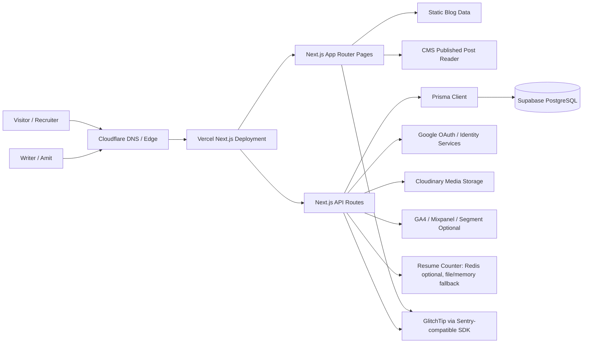

# AmitTech Portfolio + Blog CMS System Design

Last updated: 2026-06-07 20:34 IST  
Repo commit used for this document: `d6c5f91`

This document covers the current high-level design, low-level design, APIs, database models, query patterns, storage choices, and measured production latency for `amittech.in`.

## Scope

The system is a personal portfolio plus engineering publication platform with a private CMS.

Core functionality:

- Public portfolio pages: home, projects, experience, skills, contact.
- Public engineering blog: static seed posts plus published CMS posts.
- Private CMS dashboard: Google login, rich text editor, media upload, drafts, publish/unpublish/archive/delete.
- SEO surfaces: sitemap, RSS, robots, metadata, favicon, OG image generation, JSON-LD schema.
- Resume download counter and analytics forwarding.

## HLD



### Runtime Components

| Layer | Technology | Responsibility |
|---|---|---|
| CDN/DNS | Cloudflare | DNS, TLS, cache, managed robots content signals |
| Hosting | Vercel | Next.js build, serverless API routes, dynamic pages |
| Frontend | Next.js App Router, React, Tailwind | Portfolio, blog, admin dashboard, rich editor |
| API | Next.js Pages API routes | Auth, posts, media, users, downloads |
| DB ORM | Prisma | Type-safe PostgreSQL access |
| Primary DB | Supabase PostgreSQL | Users, sessions, CMS posts, tags, categories, media records |
| Media Storage | Cloudinary | Blog image/GIF/video assets |
| Auth Provider | Google Identity Services | Google ID token login |
| Session Storage | PostgreSQL `Session` table | HttpOnly cookie-backed sessions |
| Analytics | GA4/Mixpanel/Segment optional | Resume download event forwarding |
| Monitoring | GlitchTip + `/api/health` + `ApiMetric` | Error capture, warn/error logs, traces, report-only security reports, uptime checks, live-polled API latency/traffic dashboard |

## LLD

### Public Site

| Module | File | Responsibility |
|---|---|---|
| Root layout/metadata | `src/app/layout.tsx` | Global metadata, icons, manifest, GA script, layout wrapper |
| Home page | `src/app/page.tsx` | Portfolio homepage and JSON-LD profile schema |
| Blog listing | `src/app/blog/page.tsx` + `src/components/BlogSection.tsx` | Engineering publication listing, filters, search, CMS entry CTA |
| Blog article | `src/app/blog/[slug]/page.tsx` | Article page, metadata, related posts, reading progress |
| Blog adapter | `src/lib/blog.ts` | Merges static seed posts with published CMS posts |
| SEO routes | `src/app/sitemap.ts`, `src/app/rss.xml/route.ts`, `src/app/robots.ts`, `src/app/og/route.tsx` | Crawl/index surfaces and social preview images |

### CMS Dashboard

| Module | File | Responsibility |
|---|---|---|
| Dashboard shell | `src/app/admin/page.tsx` | Private dashboard page, noindex metadata |
| CMS UI | `src/components/AdminDashboard.tsx` | Auth state, post CRUD, taxonomy, media upload, preview, URL copy |
| Rich editor | `src/components/RichTextEditor.tsx` | TipTap document editor, focus mode, formatting, images, HTML fallback |
| Sanitizer | `src/lib/api/content.ts` | Safe HTML tags/styles, slug generation, reading time |

### API Services

| Service | File | Responsibility |
|---|---|---|
| Auth service | `src/lib/api/auth.ts` | Google credential verification, user upsert, session create/revoke, auth guards |
| Post service | `src/lib/api/posts.ts` | Slugs, category/tag connect-or-create, CRUD, status transitions, pagination |
| Media service | `src/lib/api/media.ts` | Multipart parsing, type/size validation, Cloudinary upload |
| HTTP helpers | `src/lib/api/http.ts` | `ok`, `created`, `ApiError`, method validation, Zod error handling |
| Prisma singleton | `src/lib/api/prisma.ts` | Reuses Prisma client in dev, error logging |
| Download counter | `src/lib/downloadCounter.ts` | Redis optional, file fallback, memory fallback |
| Analytics forwarder | `src/lib/serverAnalytics.ts` | Optional GA4/Mixpanel/Segment event forwarding |
| Monitoring runtime | `src/components/MonitoringClient.tsx`, `src/instrumentation.ts`, `src/instrumentation-client.ts`, `src/sentry.server.config.ts`, `src/sentry.edge.config.ts` | GlitchTip event reporting through the Sentry-compatible browser, node, and edge SDK |
| API metrics | `src/lib/api/metrics.ts`, `src/pages/api/admin/metrics.ts` | Records API request latency/traffic and exposes super-admin dashboard data with 5-second live polling |

## Data Storage

### Primary Database

Current primary database: PostgreSQL through Prisma. Production is configured with Supabase PostgreSQL.

### Media Storage

Uploaded CMS media goes to Cloudinary. The database stores only media metadata and URL.

### Resume Counter Storage

Current production counter response:

```json
{ "downloads": 131, "storage": "file" }
```

Important: file storage on serverless platforms is not durable across all deployments/instances. For production accuracy, use Upstash Redis/Vercel KV with:

- `KV_REST_API_URL` or `UPSTASH_REDIS_REST_URL`
- `KV_REST_API_TOKEN` or `UPSTASH_REDIS_REST_TOKEN`

## Database Models

### User

Stores authenticated CMS users.

| Field | Type | Notes |
|---|---|---|
| `id` | `String @id @default(cuid())` | Primary key |
| `name` | `String` | Google display name |
| `email` | `String @unique` | Login identity |
| `profileImage` | `String?` | Google avatar |
| `role` | `Role` | `USER` or `SUPER_ADMIN` |
| `status` | `UserStatus` | `ACTIVE`, `INACTIVE`, `BANNED` |
| `deletedAt` | `DateTime?` | Soft delete marker |

Indexes: `role`, `status`, unique `email`.

### Account

Stores OAuth provider binding.

| Field | Type | Notes |
|---|---|---|
| `provider` | `String` | Currently `google` |
| `providerAccountId` | `String` | Google `sub` |
| `userId` | `String` | FK to `User` |

Indexes: `userId`, unique `(provider, providerAccountId)`.

### Session

Stores hashed session tokens.

| Field | Type | Notes |
|---|---|---|
| `sessionTokenHash` | `String @unique` | SHA-256 of raw cookie token |
| `userId` | `String` | FK to `User` |
| `expiresAt` | `DateTime` | Session expiration |
| `revokedAt` | `DateTime?` | Logout/status invalidation |

Indexes: `userId`, `expiresAt`, unique `sessionTokenHash`.

### Category

CMS post category.

| Field | Type | Notes |
|---|---|---|
| `name` | `String` | Display name |
| `slug` | `String @unique` | URL/query identity |

### Tag

CMS post tags.

| Field | Type | Notes |
|---|---|---|
| `name` | `String` | Display name |
| `slug` | `String @unique` | Query identity |

Many-to-many relation with `Post` through Prisma generated `_PostToTag`.

### Post

CMS article model.

| Field | Type | Notes |
|---|---|---|
| `title` | `String` | Required title |
| `slug` | `String @unique` | Public URL slug |
| `excerpt` | `String?` | Hook/summary |
| `content` | `Json?` | Reserved for future JSON/MDX/structured content |
| `sanitizedHtml` | `String?` | Rich editor HTML after sanitization |
| `coverImage` | `String?` | Cloudinary/manual URL |
| `categoryId` | `String?` | FK to `Category` |
| `tags` | `Tag[]` | Many-to-many |
| `status` | `PostStatus` | `DRAFT`, `PUBLISHED`, `ARCHIVED` |
| `readingTime` | `Int` | Estimated at save time |
| `authorId` | `String` | FK to `User` |
| `publishedAt` | `DateTime?` | First publish timestamp |
| `metaTitle` | `String?` | SEO title override |
| `metaDescription` | `String?` | SEO description override |
| `ogImage` | `String?` | Social image override |
| `views` | `Int` | Incremented by post detail API for published CMS posts |
| `isFeatured` | `Boolean` | Super-admin controlled |
| `deletedAt` | `DateTime?` | Soft delete |

Indexes: `authorId`, `status`, `publishedAt`, `isFeatured`, `deletedAt`, unique `slug`.

### Media

Uploaded media metadata.

| Field | Type | Notes |
|---|---|---|
| `url` | `String` | Cloudinary secure URL |
| `type` | `MediaType` | `IMAGE`, `GIF`, `VIDEO` |
| `filename` | `String` | Original/new filename |
| `mimeType` | `String` | File MIME |
| `size` | `Int` | Bytes |
| `uploadedById` | `String` | FK to `User` |
| `postId` | `String?` | Optional FK to `Post` |
| `deletedAt` | `DateTime?` | Soft delete |

Indexes: `uploadedById`, `postId`, `type`, `deletedAt`.

## API Surface

### Public APIs

| Method | Endpoint | Auth | Functionality | DB/external work |
|---|---|---|---|---|
| `GET` | `/api/posts` | Public | List published CMS posts with filters/pagination | `Post.findMany + Post.count` transaction |
| `GET` | `/api/posts/:idOrSlug` | Public for published CMS posts | Fetch one CMS post; increments views if published | `Post.findFirst`, optional `Post.update views++` |
| `GET` | `/api/auth/config` | Public | Return Google client config | Env read only |
| `GET` | `/api/auth/me` | Optional session | Return current user or `null` | Cookie parse; if present `Session.findUnique` |
| `GET` | `/api/download-count` | Public | Return resume download count | Redis/file/memory read |
| `POST` | `/api/track-download` | Public | Forward analytics and increment resume count for resume events | GA4/Mixpanel/Segment optional, Redis/file/memory write |
| `GET` | `/api/health` | Public | Health check for uptime monitoring | Optional `SELECT 1`, env readiness checks |
| `GET` | `/rss.xml` | Public | RSS feed for all blog posts | Static posts + published CMS query |
| `GET` | `/sitemap.xml` | Public | Sitemap for home, blog, posts | Static posts + published CMS query |
| `GET` | `/robots.txt` | Public | Crawl rules | No DB |
| `GET` | `/og?title=&category=` | Public | Dynamic OG image | Edge image generation |

### Auth APIs

| Method | Endpoint | Auth | Functionality | DB/external work |
|---|---|---|---|---|
| `POST` | `/api/auth/google` | Google credential | Verify Google ID token, upsert user/account, create session cookie | Google token verify, `User.upsert`, `Session.create` |
| `POST` | `/api/auth/logout` | Optional session | Revoke current session and clear cookie | `Session.updateMany` |

### Writer APIs

| Method | Endpoint | Auth | Functionality | DB/external work |
|---|---|---|---|---|
| `POST` | `/api/posts` | `USER`/`SUPER_ADMIN` | Create draft/published post | slug uniqueness checks, `Category/Tag connectOrCreate`, `Post.create` |
| `PUT` | `/api/posts/:id` | Owner or super admin | Update own post | `Post.findUnique`, slug check, `Post.update` |
| `DELETE` | `/api/posts/:id` | Owner or super admin | Soft delete own post | `Post.findUnique`, `Post.update deletedAt` |
| `PATCH` | `/api/posts/:id/publish` | Owner or super admin | Publish post | `Post.findUnique`, `Post.update status/publishedAt` |
| `PATCH` | `/api/posts/:id/unpublish` | Owner or super admin | Move published post to draft | `Post.findUnique`, `Post.update status` |
| `PATCH` | `/api/posts/:id/archive` | Owner or super admin | Archive post | `Post.findUnique`, `Post.update status` |
| `GET` | `/api/my/posts` | `USER`/`SUPER_ADMIN` | List own posts | `Post.findMany + Post.count` where `authorId=user.id` |
| `GET` | `/api/media/my` | `USER`/`SUPER_ADMIN` | List own uploaded media | `Media.findMany` |
| `POST` | `/api/media/upload` | `USER`/`SUPER_ADMIN` | Upload media to Cloudinary and create DB row | optional `Post.findUnique`, Cloudinary upload, `Media.create` |
| `DELETE` | `/api/media/:id` | Owner or super admin | Soft delete own media | `Media.findUnique`, `Media.update deletedAt` |

### Super Admin APIs

| Method | Endpoint | Auth | Functionality | DB/external work |
|---|---|---|---|---|
| `GET` | `/api/admin/posts` | `SUPER_ADMIN` | List all posts, includes deleted by default | `Post.findMany + Post.count` |
| `PUT` | `/api/admin/posts/:id` | `SUPER_ADMIN` | Update any post, can reassign author and feature | `Post.findUnique`, `Post.update` |
| `DELETE` | `/api/admin/posts/:id` | `SUPER_ADMIN` | Soft delete any post | `Post.findUnique`, `Post.update` |
| `PATCH` | `/api/admin/posts/:id/feature` | `SUPER_ADMIN` | Set/unset featured flag | `Post.update` |
| `GET` | `/api/admin/media` | `SUPER_ADMIN` | List all media with uploader/post | `Media.findMany + Media.count` |
| `GET` | `/api/admin/users` | `SUPER_ADMIN` | List users | `User.findMany + User.count` |
| `PATCH` | `/api/admin/users/:id/role` | `SUPER_ADMIN` | Update user role | `User.update` |
| `PATCH` | `/api/admin/users/:id/status` | `SUPER_ADMIN` | Update user status; revoke sessions if inactive/banned | `User.update`, optional `Session.updateMany` |
| `GET` | `/api/admin/metrics` | `SUPER_ADMIN` | API traffic, latency percentiles, errors, timeline, slowest requests | `ApiMetric` aggregate queries |
| `POST` | `/api/admin/monitoring-test` | `SUPER_ADMIN` | Trigger controlled GlitchTip log/error test | GlitchTip SDK log/error emission, `ApiMetric` row |

## Important Request/Response Contracts

### Create Post

`POST /api/posts`

```json
{
  "title": "The Kafka Mistake That Caused Duplicate Events",
  "slug": "kafka-mistake-duplicate-events",
  "excerpt": "Everyone wants Kafka. Nobody wants the operational problems.",
  "html": "<p>Story content...</p>",
  "coverImage": "https://res.cloudinary.com/.../image.jpg",
  "category": "Distributed Systems",
  "tags": ["Kafka", "Reliability", "Backend"],
  "status": "DRAFT",
  "metaTitle": "The Kafka Mistake That Caused Duplicate Events",
  "metaDescription": "A production story about duplicate event handling.",
  "ogImage": "https://..."
}
```

Response shape:

```json
{
  "ok": true,
  "data": {
    "post": {
      "id": "...",
      "title": "...",
      "slug": "...",
      "status": "DRAFT",
      "author": {},
      "category": {},
      "tags": [],
      "media": []
    }
  }
}
```

### List Posts

`GET /api/posts?search=Kafka&category=Distributed%20Systems&tag=Kafka&page=1&pageSize=12`

Response shape:

```json
{
  "ok": true,
  "data": {
    "items": [],
    "pagination": {
      "page": 1,
      "pageSize": 12,
      "total": 0,
      "totalPages": 0
    }
  }
}
```

Current production note: public CMS API currently returns `total: 0`; blog listing still shows static seed posts because static posts are merged at the app layer in `src/lib/blog.ts`.

## Key Query Patterns

### Unique Slug Generation

Used by create/update.

```ts
while (true) {
  const existing = await prisma.post.findUnique({
    where: { slug: candidate },
    select: { id: true }
  })
  if (!existing || existing.id === currentPostId) return candidate
  candidate = `${baseSlug}-${suffix}`
}
```

Index used: unique `Post_slug_key`.

### Public/Owner/Admin Post Listing

```ts
const [items, total] = await prisma.$transaction([
  prisma.post.findMany({
    where,
    include: postInclude,
    orderBy: [{ publishedAt: 'desc' }, { createdAt: 'desc' }],
    skip,
    take: query.pageSize
  }),
  prisma.post.count({ where })
])
```

Indexes used depending on filters:

- `Post_status_idx`
- `Post_publishedAt_idx`
- `Post_authorId_idx`
- `Post_deletedAt_idx`
- `Post_isFeatured_idx`
- relation indexes for tags/categories

### Public CMS Post Detail

```ts
const post = await prisma.post.findFirst({
  where: {
    OR: [{ slug: id }, { id }],
    deletedAt: null
  },
  include: getPostInclude()
})

if (post.status === PostStatus.PUBLISHED) {
  await prisma.post.update({
    where: { id: post.id },
    data: { views: { increment: 1 } }
  })
}
```

Index used: unique `Post_slug_key` when slug is used; primary key when id is used. The `OR` can reduce planner clarity compared with separate id-vs-slug branches.

### Session Lookup

```ts
const session = await prisma.session.findUnique({
  where: { sessionTokenHash: hashSessionToken(token) },
  include: {
    user: { select: { id, name, email, role, status } }
  }
})
```

Index used: unique `Session_sessionTokenHash_key`.

### Google User Upsert

```ts
prisma.user.upsert({
  where: { email },
  update: {
    name,
    profileImage,
    accounts: {
      upsert: {
        where: { provider_providerAccountId: { provider: 'google', providerAccountId } },
        create: { provider: 'google', providerAccountId },
        update: {}
      }
    }
  },
  create: {
    email,
    name,
    profileImage,
    role,
    accounts: { create: { provider: 'google', providerAccountId } }
  }
})
```

Indexes used: unique `User_email_key`, unique `Account_provider_providerAccountId_key`.

### Media Upload

```ts
const type = getMediaType(file)
const url = await uploadToMediaStorage(file, type)
await prisma.media.create({
  data: { url, type, filename, mimeType, size, uploadedById, postId }
})
```

External dependency: Cloudinary upload latency dominates this path.

## Current Production Latency Snapshot

Measured from local machine over public internet to `https://amittech.in` on 2026-06-07. Each endpoint used 7 requests. Numbers include network, Cloudflare, Vercel, serverless startup/warm state, and database/external calls where applicable.

| Method | Route | Status | p50 ms | p95 ms | Min ms | Max ms | Notes |
|---|---|---:|---:|---:|---:|---:|---|
| GET | `/` | 200 | 122 | 410 | 105 | 410 | Home page shell |
| GET | `/blog` | 200 | 1230 | 1654 | 1047 | 1654 | Dynamic blog listing, includes CMS DB read path |
| GET | `/blog/kafka-mistake-duplicate-events-production` | 200 | 125 | 169 | 118 | 169 | Static blog article page |
| GET | `/api/posts?pageSize=12` | 200 | 1536 | 3842 | 1194 | 3842 | Public CMS posts API |
| GET | `/api/posts?search=Kafka&pageSize=12` | 200 | 1536 | 1841 | 1241 | 1841 | Public CMS post search |
| GET | `/api/posts/kafka-mistake-duplicate-events-production` | 404 | 918 | 1229 | 592 | 1229 | Static seed post is not in CMS API |
| GET | `/api/auth/config` | 200 | 610 | 635 | 376 | 635 | Env-only config response |
| GET | `/api/auth/me` | 200 | 368 | 855 | 354 | 855 | Anonymous session lookup |
| GET | `/api/my/posts` | 401 | 615 | 2066 | 373 | 2066 | Unauthenticated writer route |
| GET | `/api/admin/posts` | 401 | 592 | 1165 | 400 | 1165 | Unauthenticated admin route |
| GET | `/api/download-count` | 200 | 374 | 699 | 333 | 699 | Counter read; currently file fallback |
| POST | `/api/track-download` | 200 | 769 | 918 | 381 | 918 | Latency probe did not increment resume count |
| GET | `/rss.xml` | 200 | 745 | 3842 | 576 | 3842 | Static + CMS feed |
| GET | `/sitemap.xml` | 200 | 921 | 3384 | 614 | 3384 | Static + CMS sitemap |
| GET | `/favicon.ico` | 200 | 118 | 140 | 108 | 140 | Static icon |

### Latency Interpretation

- Static pages and favicon are fast: roughly 100-170 ms p50.
- Dynamic blog/API paths are slower: roughly 700-1500 ms p50, with p95 spikes above 3 seconds.
- The slow path is likely a combination of dynamic rendering, Supabase DB connection/query latency, and Vercel serverless warm/cold behavior.
- `/api/posts/:slug` returning 404 for static seed posts is expected with the current architecture. Static posts are not duplicated in PostgreSQL.

## Optimization Opportunities

Priority order:

1. Cache published CMS post reads with short TTL or Next unstable cache.
2. Avoid CMS DB query on every `/blog` render when there are zero CMS posts.
3. Split `/api/posts/:idOrSlug` into id-vs-slug lookup instead of `OR`.
4. Add composite indexes if CMS volume grows:
   - `(status, deletedAt, publishedAt DESC)`
   - `(authorId, deletedAt, updatedAt DESC)`
   - `(isFeatured, status, deletedAt)`
5. Move resume counter from file fallback to Upstash Redis/Vercel KV.
6. Add lightweight request timing logs around Prisma queries for server-side latency, because current numbers are end-to-end.
7. Consider moving public CMS reads to edge-friendly cache or build-time revalidation when post publish happens.

## Security and Data Integrity

- Sessions use HttpOnly cookies.
- Raw session tokens are not stored; SHA-256 hash is stored in PostgreSQL.
- Google ID token must match `GOOGLE_CLIENT_ID`.
- Role is derived from `SUPER_ADMIN_EMAILS`.
- Regular users can manage only their own posts/media.
- Super admins can manage all posts/users/media.
- Posts/media use soft deletes through `deletedAt`.
- Rich text HTML is sanitized before persistence.
- Cloudinary credentials stay server-side.

## Current Gaps

- No server-side per-query latency metrics yet.
- Resume counter is currently using file fallback in production; this is not ideal for serverless durability.
- Public API only returns CMS posts; static seed posts are available through app pages, sitemap, RSS, and `src/lib/blog.ts`.
- Public CMS post list currently has `total: 0`, so CMS is ready but no published DB posts exist yet.
- Authenticated write API latency was not measured with a real session in this snapshot.

## Operational Runbook

### Publish a CMS Post

1. Open `/blog`.
2. Click `Write article`.
3. Sign in with Google.
4. Create or edit article in `/admin`.
5. Add title, excerpt, category, tags, cover image, body, SEO metadata.
6. Click `Publish`.
7. Use `Copy URL` from preview.
8. Check `/blog`, `/sitemap.xml`, and `/rss.xml`.
9. Submit the URL in Google Search Console.

### Production Health Checks

```bash
curl -I https://amittech.in
curl -I https://amittech.in/blog
curl -I https://amittech.in/favicon.ico
curl -sS https://amittech.in/api/posts?pageSize=1
curl -sS https://amittech.in/api/download-count
curl -sS https://amittech.in/sitemap.xml | head
curl -sS https://amittech.in/rss.xml | head
```

### Deployment Verification

```bash
npm run build
npm run test:e2e
npx -y vercel@latest --prod --yes
npx -y vercel@latest logs <deployment-id> --since 10m --status-code 500 --expand
```
